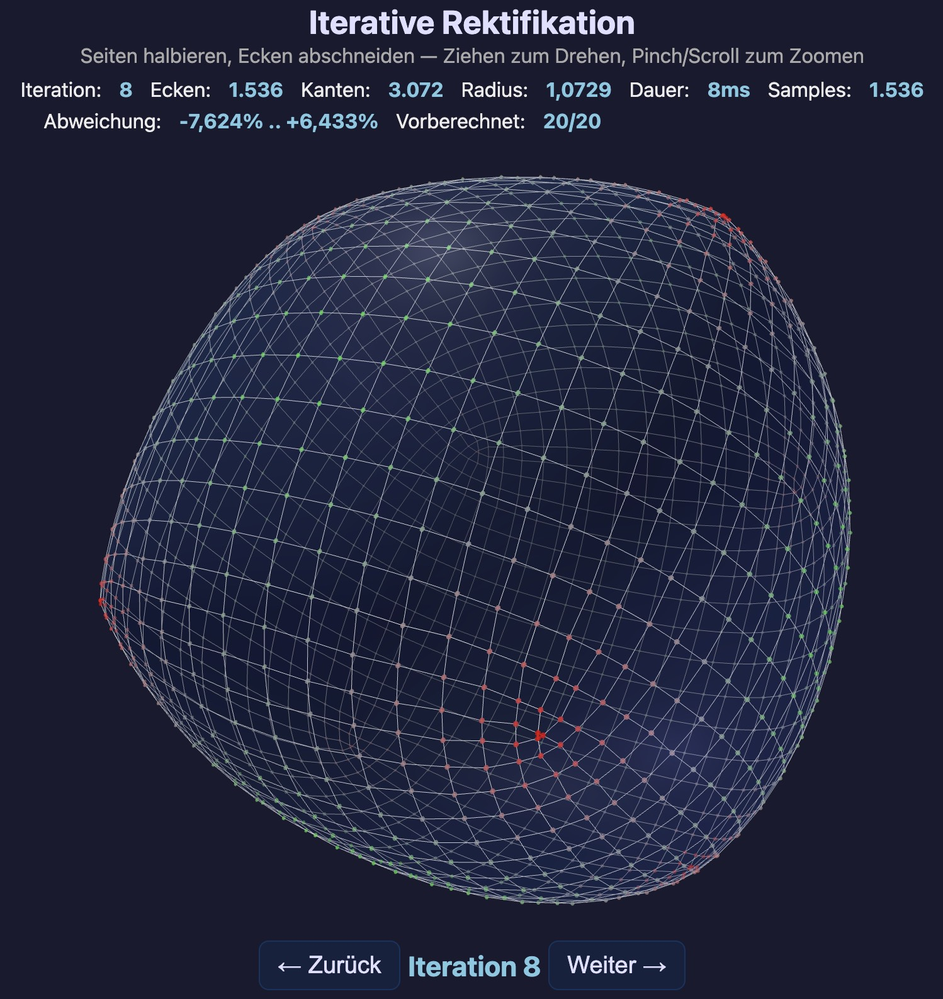

# Vom Würfel zur Kugel?

Interaktive 3D-Visualisierung: Einen Würfel iterativ rektifizieren und beobachten, wohin er konvergiert.

**[Live-Demo](https://crambambuli.github.io/cube-to-sphere/cube-rectification.html)**


## Das Problem

Gegeben ein Würfel. Man halbiert alle Kanten und schneidet an den Mittelpunkten die Ecken ab. Es entsteht ein neuer konvexer Körper mit mehr Flächen, Kanten und Ecken. Dieses Verfahren wiederholt man: wieder alle Kanten halbieren, wieder die Ecken abschneiden — und immer so weiter.

**Frage:** Welche Form entsteht, wenn man diesen Prozess unendlich oft wiederholt?

**Antwort:** Keine Kugel. Der Körper konvergiert gegen einen spezifischen O<sub>h</sub>-symmetrischen konvexen Körper mit ca. 14% Durchmesser-Variation — kugelähnlich, aber messbar nicht-sphärisch.

## Mathematischer Hintergrund

Die Operation heißt **Rektifikation** — man ersetzt jeden Vertex durch eine neue Fläche und jede Fläche durch eine kleinere Version ihrer selbst. Die neuen Vertices sind genau die Mittelpunkte der alten Kanten.

Bei der Definition gibt es eine Wahl: Wie verbindet man die neuen Vertices zu Flächen? Die App implementiert **zwei Varianten** mit unterschiedlichem Verhalten:

- **Topologisch** — Flächen werden kombinatorisch fortgeschrieben: jede alte Fläche schrumpft, jede alte Ecke wird zu einer neuen Fläche.
- **Convex Hull** — pro Iteration wird die konvexe Hülle aller neuen Vertices gebildet (rein geometrisch).

Bis Iteration 4 sind beide Varianten identisch. Ab Iteration 5 weichen sie voneinander ab — die topologische Variante hält non-planare Vierecke als ein Polygon, die Hull-Variante spaltet sie in Dreiecke.

Beide Varianten konvergieren gegen **denselben Grenzkörper** — sie unterscheiden sich nur in der Wahl der Triangulierung der non-planaren Vertex-Figuren bei endlichen Iterationen.

### Was beide Varianten gemeinsam haben

**Vertex-Anzahl V' = E.** Pro Iteration wird jeder Kantenmittelpunkt zu einem neuen Vertex. Die alten Vertices verschwinden. V verdoppelt sich nicht ganz, aber wächst exponentiell.

**O<sub>h</sub>-Symmetrie.** Der Würfel hat die Oktaedersymmetrie O<sub>h</sub> (48 Symmetrieoperationen). Die Bezeichnung stammt aus der Schoenflies-Notation: **O** steht für die Oktaeder-Drehgruppe (24 reine Drehungen), **h** für die Erweiterung um Spiegelungen. Dies ist gleichzeitig die Symmetriegruppe des Würfels und des Oktaeders, da beide duale Körper sind.

Jede Symmetrieoperation bildet Ecken auf Ecken, Kanten auf Kanten, Kantenmittelpunkte auf Kantenmittelpunkte ab. Die Menge der Mittelpunkte ist O<sub>h</sub>-invariant → die konvexe Hülle auch → jede Iteration erhält die O<sub>h</sub>-Symmetrie. ✓

**Konvergenz gegen einen nicht-sphärischen Grenzkörper.** Die Vermutung liegt nahe, dass iterierte Rektifikation den Würfel zu einer Kugel glättet. Die numerische Simulation zeigt jedoch, dass die Abweichung von der Best-Fit-Kugel gegen einen festen Wert konvergiert, nicht gegen null:

```
Iter  Beule (außen)    Delle (innen)
─────────────────────────────────────────────────
  0   ▏                ▏                    0,000%
  1   ▏                ▏                    0,000%
  2   ▏                ▏                    0,000%
  3   ████▏            ████▏                2,548%
  4   ████████▏        ███████▏             4,884%
  5   ██████████▏      █████████▏           6,272%
  6   ████████████▏    ██████████▏          7,042%
  7   █████████████▏   ██████████▏          7,438%
  8   █████████████▏   ███████████▏         7,640%
  9   █████████████▏   ███████████▏         7,742%
 10   █████████████▏   ███████████▏         7,793%
 ...
 15   ██████████████▏  ███████████▏         7,843%
 20   ██████████████▏  ███████████▏         7,845%
         -7,845%          +6,604%
```

Iterationen 0–2 haben exakt 0% Abweichung, weil alle Vertices gleich weit vom Zentrum entfernt sind (Würfel, Kuboctaeder und dessen Rektifikation haben jeweils gleich lange Kanten und äquidistante Vertices).

| Iteration | Min (Beule) | Max (Delle) |
|-----------|-------------|-------------|
| 0 | 0,000% | +0,000% |
| 1 | 0,000% | +0,000% |
| 2 | 0,000% | +0,000% |
| 3 | -2,548% | +2,548% |
| 5 | -6,272% | +5,407% |
| 7 | -7,438% | +6,291% |
| 10 | -7,793% | +6,564% |
| 13 | -7,838% | +6,599% |
| 15 | -7,843% | +6,602% |
| 20 | -7,845% | +6,604% |

Die Abweichung stabilisiert sich bei **-7,845% / +6,604%** — der Körper konvergiert gegen einen nicht-sphärischen Grenzkörper. Bemerkenswert: die Beulen (an den Würfelecken) sind stärker ausgeprägt als die Dellen (an den Flächenzentren).

**Die Ursache: topologische Nicht-Uniformität.** Ab Iteration 1 haben alle Vertices Grad 4 (4 angrenzende Kanten) — der Vertex-Grad ist also homogen. Die Heterogenität liegt in der **Flächen-Nachbarschaft**: welche Flächentypen an einem Vertex zusammenkommen.

Die 8 Dreiecke aus den ursprünglichen Würfelecken bleiben über alle Iterationen als Flächen erhalten (sie schrumpfen nur). Sie sind die topologischen Singularitäten — alle anderen Flächen sind Vierecke oder werden aus solchen gebildet. Damit gibt es Vertices, die an ein Dreieck grenzen, und Vertices, die nur an Vierecke grenzen:

- **Iter 1** (Kuboctaeder): Jeder Vertex grenzt an 2 Dreiecke + 2 Quadrate — noch homogen.
- **Iter 2** (24 Vertices): Jeder Vertex grenzt an 1 Dreieck + 3 Vierecke — noch homogen.
- **Iter 3** (48 Vertices): Zwei Vertex-Klassen
  - 24 Vertices "nahe einem Dreieck" — grenzen an 1 geschrumpftes Dreieck + 3 Vierecke
  - 24 Vertices "weiter weg" — grenzen an 4 Vierecke
- **Iter 4+**: Mehr Klassen je nach Abstand zur nächsten Würfelecke.

Bei höheren Iterationen entstehen also immer mehr Vertex-Klassen, die sich durch ihre Entfernung zu den 8 Dreiecks-Singularitäten unterscheiden. Diese strukturelle Asymmetrie erzeugt einen stationären Zustand, in dem die Beulen an den 8 Würfelecken-Positionen und die Dellen an den 6 Flächenzentren dauerhaft bestehen bleiben.

**Vergleich mit Subdivision Surfaces:** In der Computergrafik ist bekannt, dass "extraordinary elements" (Flächen mit nicht-standardmäßiger Eckenzahl) in Catmull-Clark-Subdivision die Grenzfläche lokal deformieren. Das gleiche Prinzip gilt hier — die 8 Dreiecke sind die "extraordinary faces" in einem ansonsten Quad-dominierten Mesh.

### Variante 1: Topologische Rektifikation

Bei jeder Iteration entstehen zwei Typen neuer Flächen:

- **Geschrumpfte Flächen**: Jede alte Fläche wird durch eine kleinere Fläche mit gleicher Kantenzahl ersetzt. Die Ecken der neuen Fläche sind die Mittelpunkte der alten Kanten. Ein Quadrat wird zu einem kleineren Quadrat, ein Dreieck zu einem kleineren Dreieck.

- **Vertex-Figuren**: Wenn man "die Ecken abschneidet", bleibt an jeder alten Ecke eine Schnittfläche. Ihre Kantenzahl entspricht dem Grad des alten Vertex. Beim Würfel hat jede Ecke 3 Kanten → Vertex-Figur ist ein Dreieck. Ab Iteration 1 haben alle Vertices Grad 4 → alle Vertex-Figuren sind Vierecke.

#### Euler-Formeln

Bei jeder Iteration gilt exakt (beweisbar über V - E + F = 2):

| Größe | Formel | Entwicklung |
|-------|--------|-------------|
| Ecken | V' = E | 8 → 12 → 24 → 48 → 96 → 192 → ... |
| Kanten | E' = 2E | 12 → 24 → 48 → 96 → 192 → 384 → ... |
| Flächen | F' = V + F | 6 → 14 → 26 → 50 → 98 → 194 → ... |

Die Kanten verdoppeln sich exakt bei jeder Iteration.

#### Nur Dreiecke und Vierecke

Ab Iteration 1 gibt es ausschließlich **Dreiecke** und **Vierecke** — keine Fünf-, Sechsecke oder höher.

Der Grund: Jeder neue Vertex ist der Mittelpunkt einer alten Kante. Jede alte Kante grenzt an genau 2 Flächen und hat 2 Endpunkte (mit je einer Vertex-Figur). Also ist jeder neue Vertex von genau 4 Flächen umgeben → **alle Vertices haben Grad 4** → alle Vertex-Figuren sind Vierecke.

Konkret:
- **8 Dreiecke** — von den 8 Würfelecken. Bleiben als geschrumpfte Dreiecke über alle Iterationen erhalten.
- **Alle anderen Flächen: Vierecke** — geschrumpfte Quads + Vertex-Figuren (Grad 4).

#### Sind die Flächen immer plan?

Geschrumpfte Flächen liegen immer exakt in einer Ebene (die Mittelpunkte der Kanten einer planaren Fläche sind koplanar). ✓

Vertex-Figuren (Vierecke) sind genau dann plan, wenn die 4 Nachbarn des alten Vertex koplanar sind. Das ist **nicht immer** der Fall:

- **Dreiecke** (die 8 von den Würfelecken): immer exakt plan — 3 Punkte definieren eine Ebene. ✓
- **Iter 1→2**: Der Kuboctaeder ist kantentransitiv (alle Kanten unter O<sub>h</sub> äquivalent). Die O<sub>h</sub>-Symmetrie erzwingt Koplanarität → alle Quads exakt plan. ✓
- **Iter 2→3**: Nicht mehr kantentransitiv. Quads an hochsymmetrischen Positionen (z.B. mit 4-facher Rotationsachse) sind noch exakt plan. Quads an weniger symmetrischen Positionen können leicht nicht-planar sein.
- **Ab Iter ~4-5**: Die meisten Quads sind fast plan (Abweichung schrumpft quadratisch mit der Kantenlänge), aber mathematisch nicht exakt — die lokale Symmetrie reicht nicht mehr aus.

Die Nicht-Planarität ist proportional zum Quadrat der Kantenlänge: bei Iter 3 in der Größenordnung 10⁻², bei Iter 10+ unter 10⁻⁸.

#### Rendering nicht-planarer Quads

Bei einem nicht-planaren Quad muss die 3D-Darstellung eine Entscheidung treffen, wie die Fläche approximiert wird:

1. **Fan-Triangulierung (2 Dreiecke):** Quad wird entlang einer willkürlichen Diagonale in 2 Dreiecke geteilt. Einfach, aber erzeugt einen Knick an der Diagonale.
2. **Mittelpunkt-Triangulierung (4 Dreiecke):** ✅ Der Schwerpunkt der 4 Ecken wird als 5. Vertex eingefügt, das Quad in 4 Dreiecke geteilt. Der Knick wird gleichmäßig auf alle 4 Seiten verteilt. **Diese Variante ist implementiert.**
3. **Kürzeste Diagonale:** Wie (1), aber die Diagonale mit dem kleineren Knickwinkel wählen.
4. **Bilineare Interpolation:** Das Quad als gewölbte Fläche (bilineares Patch) rendern, unterteilt in ein feines Gitter. Kein Knick, dafür höhere GPU-Last.
5. **Catmull-Clark Subdivision:** Jedes Quad in 4 Sub-Quads mit geglätteten Positionen unterteilen. Erzeugt eine glatte Oberfläche, verändert aber die Geometrie.

### Variante 2: Convex-Hull-Rektifikation

Statt die Vertex-Figuren als (möglicherweise non-planare) Polygone topologisch fortzuschreiben, kann man die Operation rein geometrisch definieren: pro Iteration **alle Kantenmittelpunkte sammeln und ihre konvexe Hülle bilden**. Die Vertex-Anzahl bleibt identisch (V' = E), aber non-planare Vertex-Figuren werden vom Hull-Algorithmus zwangsläufig in mehrere Dreiecke aufgespalten. Die resultierenden Flächen sind per Definition immer exakt plan.

Da alle Vertex-Koordinaten dyadisch rational sind (Nenner 2<sup>iter</sup>), kann der Hull-Algorithmus mit **exakter Integer-Arithmetik** rechnen — keine Floating-Point-Toleranzen, keine Rundungsfehler. Die Ergebnisse stimmen exakt mit `scipy.spatial.ConvexHull` überein.

#### Algorithmus

Der implementierte Hull-Algorithmus ist ein **inkrementeller 3D-Convex-Hull** mit anschließendem **koplanaren Polygon-Merge**:

**Schritt 1 — Integer-Repräsentation.** Die Vertex-Koordinaten der vorherigen Iteration liegen als Floats vor, sind aber exakt darstellbar (dyadisch rational mit Nenner 2<sup>iter−1</sup>). Wir multiplizieren mit 2<sup>iter−1</sup> und runden, um die ganzzahligen Koordinaten exakt zurückzugewinnen.

**Schritt 2 — Edge-Midpoints.** Für jede Polygon-Kante (a, b) der vorherigen Iteration berechnen wir den Mittelpunkt. In Integer-Arithmetik wird das einfach zu `int_a + int_b` (kein Division), wobei der neue Maßstab automatisch 2<sup>iter</sup> ist. Beispiel: Würfelvertices ±1 (Maßstab 1), Edge-Midpoint von (1,1,1) und (−1,1,1) ist int (0, 2, 2) im 2-fach feineren Gitter, was real (0, 1, 1) entspricht.

**Schritt 3 — Initiales Tetraeder.** Wir wählen 4 nicht-koplanare Punkte als Startsimplex:
1. Punkt mit minimalem x.
2. Punkt mit maximalem x.
3. Punkt mit größtem Abstand zur Linie zwischen den beiden ersten.
4. Punkt mit größtem (vorzeichenbehaftetem) Abstand zur Ebene der ersten drei.

Die Orientierung der vier Tetraeder-Flächen wird so festgelegt, dass alle Normalen nach außen zeigen.

**Schritt 4 — Inkrementelle Erweiterung.** Für jeden weiteren Punkt p:
1. **Sichtbarkeitstest:** Eine Fläche f mit Normale n und Stützwert d ist von p aus sichtbar gdw. n·p ≥ d. Mit gecachten Integer-Normalen ist das ein einziges Skalarprodukt + Vergleich, exakt ohne Toleranz. Koplanare Punkte (n·p = d) werden als sichtbar behandelt — sonst gingen sie als Hull-Vertices verloren.
2. **Sichtbare Region entfernen:** Alle sichtbaren Flächen werden gelöscht.
3. **Grenzkanten finden:** Eine Kante ist Grenze gdw. sie nur in einer entfernten Fläche vorkam (innere Kanten der entfernten Region kommen zweimal vor und heben sich auf). Implementiert via Map mit gerichteten Kanten — gegenläufige Paare löschen sich.
4. **Cone bilden:** Für jede Grenzkante (a, b) wird ein neues Dreieck (a, b, p) angelegt, mit cached Integer-Normale für künftige Sichtbarkeitstests.

**Schritt 5 — Koplanare Dreiecke mergen.** Der Hull liefert nur Dreiecke. Größere planare Flächen (Quads, Pentagons, Hexagons) entstehen durch Zusammenfassen koplanarer Nachbarn:
1. Für jede gemeinsame Kante zweier Dreiecke (a, b, c) und (a, b, d) wird die 3×3-Determinante det(b−a, c−a, d−a) ausgewertet. = 0 ⇒ koplanar (exakter Test über Integer-Differenzen).
2. Union-Find fasst alle paarweise koplanaren Dreiecke zu einem Cluster zusammen.
3. Pro Cluster werden die Boundary-Kanten extrahiert (Kanten die nur einmal vorkommen) und zu einem zyklischen Polygon verbunden.

**Komplexität.** Der inkrementelle Algorithmus ist im Worst-Case O(n²), für unsere Verteilungen in der Praxis ähnlich (jeder Punkt sieht ~ O(n<sup>1/2</sup>) Flächen). Bei iter 11 mit ~31.000 Punkten dauert die Berechnung ca. 17 s. Quickhull (O(n log n) im Mittel) wäre asymptotisch besser, würde die exakten Predikate aber komplizierter machen.

**Numerische Sicherheit.** Bei iter ≤ 14 bleiben alle Zwischenwerte (Cross-Products, Determinanten) innerhalb des JavaScript Safe-Integer-Bereichs (< 2<sup>53</sup>). Konkret: bei iter 12 sind Vertex-Koordinaten bis ±4096, Cross-Product-Komponenten bis ~7×10<sup>7</sup>, Determinanten-Terme bis ~3×10<sup>12</sup>. Für höhere Iterationen wäre BigInt nötig.

| Iter | V | E | F | n-Eck-Verteilung |
|------|------|------|------|------|
| 0 | 8 | 12 | 6 | 4-Eck:6 |
| 1 | 12 | 24 | 14 | 3-Eck:8, 4-Eck:6 |
| 2 | 24 | 48 | 26 | 3-Eck:8, 4-Eck:18 |
| 3 | 48 | 96 | 50 | 3-Eck:8, 4-Eck:42 |
| 4 | 96 | 192 | 98 | 3-Eck:8, 4-Eck:90 |
| **5** | **192** | **432** | **242** | **3-Eck:104, 4-Eck:138** |
| 6 | 432 | 1.008 | 578 | 3-Eck:296, 4-Eck:282 |
| 7 | 1.008 | 2.352 | 1.346 | 3-Eck:680, 4-Eck:666 |
| 8 | 2.352 | 5.424 | 3.074 | 3-Eck:1.448, 4-Eck:1.626 |
| 9 | 5.424 | 13.008 | 7.586 | 3-Eck:4.376, 4-Eck:3.162, 5-Eck:48 |
| 10 | 13.008 | 31.104 | 18.098 | 3-Eck:10.376, 4-Eck:7.578, 5-Eck:96, 6-Eck:48 |
| 11 | 31.104 | 75.168 | 44.066 | 3-Eck:26.360, 4-Eck:17.322, 5-Eck:336, 6-Eck:48 |
| 12 | 75.168 | 181.776 | 106.610 | 3-Eck:63.944, 4-Eck:41.658, 5-Eck:960, 6-Eck:48 |

**Iter 0–4: identisch zur topologischen Rektifikation.** Alle Vertex-Figuren sind exakt planar (im Sinne der ganzzahligen Arithmetik, siehe [Technische Umsetzung](#convex-hull-rektifikation-rectifyhull)), der Hull-Algorithmus sieht sie als ein Quad. Es gibt genau 8 Dreiecke (die unveränderten Würfelecken).

**Iter 4 → 5: Symmetriebruch.** 48 Vertex-Figur-Quads werden non-planar genug, dass der Hull sie in je 2 Dreiecke spaltet:
- +48 Diagonalen (Kanten)
- +48 Flächen (-1 Quad +2 Dreiecke = +1 Fläche)
- 0 zusätzliche Vertices

Die Zahl **48** ist exakt die Ordnung der Symmetriegruppe O<sub>h</sub> — also genau eine generische O<sub>h</sub>-Bahn von Quads bricht zuerst die Planarität.

**Iter 9: Pentagons. Iter 10: Hexagons.** Bei höheren Iterationen entstehen 5- und 6-Ecke, wenn mehrere non-planare Quads im Hull zu einem größeren Polygon mergen.

**Bemerkenswerte Muster bei höheren Iterationen:**

- **Hexagons bleiben konstant bei 48.** Seit ihrem ersten Auftreten in Iter 10 ist die Anzahl der 6-Ecke unverändert: 48 in Iter 10, 11, 12. Das ist genau eine O<sub>h</sub>-Bahn — vermutlich entstehen sie an einer einzigen ausgezeichneten Symmetrie-Position (möglicherweise auf den 3-fachen Achsen durch die Würfelecken, dort wo 3 Dreiecke benachbart sind) und bleiben in jeder Iteration als ein einzelner stabiler Orbit erhalten.
- **Pentagons wachsen stark.** Anzahl der 5-Ecke: 48 → 96 → 336 → 960. Die Sprünge folgen keinem einfachen Verdopplungsmuster — die Wachstumsfaktoren sind 2, 3,5, 2,86. Sie entstehen an immer mehr Symmetrie-Positionen, wenn weitere Quads non-planar werden.
- **Dreiecke und Vierecke skalieren ungefähr proportional zur Vertex-Anzahl** und dominieren die Topologie. Ihr Verhältnis schwankt aber: bei iter 10 sind ~57% der Flächen Dreiecke, bei iter 12 schon ~60%.
- **Die 48 ist allgegenwärtig**, weil |O<sub>h</sub>| = 48: alle generischen Bahnen haben Größe 48, höhersymmetrische Positionen produzieren Teiler von 48 (24, 12, 8, 6).

### Vergleich der beiden Varianten

| | Topologische Rektifikation | Convex-Hull-Rektifikation |
|--|--|--|
| Vertex-Anzahl | identisch (V' = E) | identisch (V' = E) |
| Kanten-Anzahl | E' = 2E (immer) | ≥ 2E, divergiert ab Iter 5 |
| Flächen | Polygone (möglicherweise non-planar) | exakt planar |
| Topologie | konstant: 8 Dreiecke + Rest Quads | wechselnd: ab Iter 5 mehr Dreiecke, ab Iter 9 auch Pentagons/Hexagons |
| Konvergenz | gleicher Grenzkörper | gleicher Grenzkörper |

Beide Varianten sind in der App per Toggle-Button umschaltbar (nur im Polyeder-Modus, Iter ≤ 12). Sie laufen parallel im Hintergrund auf zwei separaten Web Workern und können dadurch unabhängig voneinander berechnet werden.

### Der Grenzkörper

Der Grenzkörper ist ein wohldefinierter O<sub>h</sub>-symmetrischer konvexer Körper mit:
- 8 leichten Beulen an den Positionen der ursprünglichen Würfelecken
- 6 leichten Dellen an den Positionen der ursprünglichen Flächenzentren
- ca. 14% Unterschied zwischen größtem und kleinstem Durchmesser
- unendlich vielen Flächen (im Grenzwert glatt)

Er ist **kein** bekannter Standardkörper (weder Kugel noch ein reguläres Polyeder).

### Bemerkenswerte Zwischenkörper

- **Iteration 0:** Würfel (8 Ecken, 12 Kanten, 6 Flächen)
- **Iteration 1:** Kuboctaeder (12 Ecken, 24 Kanten, 14 Flächen) — ein archimedischer Körper
- **Iteration 2:** Rhombikuboctaeder-artig (24 Ecken, 48 Kanten, 26 Flächen)
- **Ab Iteration 5:** visuell kugelähnlich, aber messbar nicht-sphärisch

## Die Anwendung

### Darstellung

Die Anwendung zeigt den Körper in zwei Modi:

- **Iteration 0–12 (Polyeder-Modus):** Halbtransparente Flächen mit weißen Kanten und farbcodierten Vertex-Punkten. Die Flächen werden in zwei Passes gerendert (Rückseite, dann Vorderseite) für korrektes Alpha-Blending. Beim Iterationswechsel wird fließend zwischen altem und neuem Körper überblendet (1s Cross-Fade mit Ease-in-out).



- **Ab Iteration 13 (Kugel-Modus):** Eine halbtransparente Best-Fit-Kugel als Referenz. Der Körper schrumpft natürlich mit jeder Iteration (Kantenmittelpunkte liegen näher am Zentrum als die Endpunkte). Nur noch farbcodierte Vertex-Punkte sind sichtbar — die Flächen und Kanten würden bei >50.000 Vertices den Browser überlasten. Punkte werden mit `depthTest: false` gerendert, damit auch die innerhalb der Kugel liegenden (grünen) sichtbar bleiben.


Die roten Punkte (außerhalb der Kugel) clustern an den 8 Würfelecken-Positionen, die grünen (innerhalb) an den 6 Flächenzentren — sichtbares Resultat der topologischen Nicht-Uniformität.

### Farbcodierung der Punkte

Jeder Vertex-Punkt ist nach seiner Abweichung von der Best-Fit-Kugel eingefärbt:

- **Rot** — außerhalb der Kugel (Beule, an den Würfelecken-Positionen)
- **Grün** — innerhalb der Kugel (Delle, an den Flächenzentren)
- **Grau** — auf der Kugeloberfläche (Abweichung < 0,001%, z.B. bei Iter 0–2 wo alle Vertices exakt equidistant sind)

Die Farbintensität skaliert linear mit der Abweichung: je weiter vom Kugelradius, desto kräftiger die Farbe. Zusätzlich verblassen Punkte und Kanten mit zunehmender Entfernung zur Kamera (Live-Update bei Rotation, auch während der Animation): vordere Elemente sind kräftig, hintere blass.

### Sampling

Bei mehr als 50.000 Vertices (Desktop) bzw. 25.000 (Mobilgeräte) wird ein gleichmäßiges Zufalls-Sample angezeigt (Fisher-Yates Shuffle). Die Stats-Zeile zeigt die Anzahl der dargestellten Samples. Die Punktgröße nimmt mit jeder Iteration ab (0,014 bei Iter 0 → 0,003 ab Iter 13).

Bei Speicherfehlern (insbesondere auf Mobilgeräten) wird die Punktanzahl automatisch halbiert und das Rendering erneut versucht.

### Stats-Zeile

| Feld | Bedeutung |
|------|-----------|
| Iteration | Aktuelle Rektifikationsstufe (0 = Würfel) |
| Ecken | Anzahl Vertices (exakt aus Topologie, nicht Euler-Schätzung) |
| Kanten | Anzahl Kanten |
| Flächen | Anzahl Polygon-Flächen |
| n-Ecke | Aufschlüsselung der Flächen nach Eckenzahl (z.B. `3-Eck:104, 4-Eck:138`) |
| Radius | Durchschnittsabstand der Vertices vom Ursprung (schrumpft pro Iteration) |
| Dauer | Berechnungszeit der Iteration im Web Worker |
| Samples | Angezeigte Vertex-Punkte (= alle, oder Sample bei hohen Iterationen) |
| Abweichung | Min/Max-Abweichung von der Best-Fit-Kugel in Prozent |
| Vorberechnet | Höchster vorberechneter Index pro Variante (z.B. `topo 12/20, hull 8/12`) |

Werte zeigen "-" an, solange die Iteration noch berechnet wird.

### Vorberechnung

Iterationen werden im Hintergrund sequentiell vorberechnet (0 → 1 → 2 → ...). Topo und Hull laufen auf zwei separaten Web Workern echt parallel — Topo ist üblicherweise viel schneller (~50ms bei Iter 11 vs ~25s für Hull). Beim Klick auf "Weiter" wird entweder das vorberechnete Ergebnis sofort angezeigt oder eine Sanduhr (⏳), bis die Berechnung abgeschlossen ist. Bei Variantenwechsel wird der aktuell sichtbare Körper sofort durch das Pendant der anderen Variante ersetzt (sofern bereits vorberechnet).

### Mobilgeräte

Auf Mobilgeräten (erkannt via User-Agent und Viewport-Breite < 768px) gelten reduzierte Limits:

| Parameter | Desktop | Mobil |
|-----------|---------|-------|
| Max. Iterationen | 20 | 18 |
| Max. Samples | 50.000 | 25.000 |

## Bedienung

| Aktion | Desktop | Mobil |
|--------|---------|-------|
| Nächste Iteration | Weiter-Button oder → oder Leertaste | Weiter-Button |
| Vorherige Iteration | Zurück-Button oder ← | Zurück-Button |
| Variante umschalten (Topo ↔ Hull) | "Variante"-Button (nur im Polyeder-Modus) | "Variante"-Button |
| Körper drehen | Maus ziehen | 1 Finger ziehen |
| Verschieben (Pan) | Shift+Maus ziehen oder Rechtsklick ziehen | 2 Finger ziehen |
| Zoomen | Scrollrad | 2-Finger-Pinch |
| Rotation stoppen/starten | Doppelklick | Doppeltap |

Pinch und Pan funktionieren gleichzeitig: der Abstand der beiden Finger steuert den Zoom, die gemeinsame Bewegung den Pan.

Die Auto-Rotation pausiert 3 Sekunden nach manueller Interaktion und setzt dann wieder ein. Per Doppelklick/Doppeltap lässt sie sich dauerhaft stoppen bzw. wieder starten.

## Technische Umsetzung

### Architektur

```
  Main Thread                                Worker (topo)              Worker (hull)
  (index.html)                               (worker.js)                (worker.js)
                                             ─────────────              ─────────────
                  {iter, variant: 'topo'}
  Three.js  ────────────────────────────────► rectifyTopological()
  Rendering ◄────────────────────────────────                            
            {coords, triIndices, ngonDist}                               
                  {iter, variant: 'hull'}                                
            ─────────────────────────────────────────────────────────────► rectifyHull()
            ◄─────────────────────────────────────────────────────────────
            {coords, triIndices, ngonDist}
```

- **Main Thread** (`index.html`): Three.js-Szene, Kamera, Beleuchtung, Rendering, UI-Events. Verwaltet getrennte Histories für beide Varianten. Keine geometrische Berechnung — nur Darstellung.
- **Zwei Worker** (`worker.js`): Eine Instanz für jede Variante, läuft auf eigenem Thread → echt parallel. Jeder Worker pflegt eigenen Zustand (Vertices + Faces) über Iterationen. Beide Varianten werden im Hintergrund parallel vorberechnet.

### Topologische Rektifikation (`rectifyTopological`)

Führt die **Flächen-Topologie** explizit mit, ohne Approximation:

1. **Kanten sammeln:** Aus den Polygon-Flächen werden alle Kanten und deren Mittelpunkte berechnet.
2. **Geschrumpfte Flächen:** Jede alte Fläche wird durch die Mittelpunkte ihrer Kanten ersetzt.
3. **Vertex-Figuren:** Für jeden alten Vertex werden die Mittelpunkte seiner Kanten in der richtigen zyklischen Reihenfolge (via Flächen-Adjazenz) zu einem neuen Polygon verbunden.
4. **Triangulierung:** Mittelpunkt-Triangulierung für non-planare Quads (4 Dreiecke), Fan-Triangulierung für planare Quads (2 Dreiecke).
5. **Polygon-Kanten:** Kanten direkt aus den Polygon-Flächen, um Diagonalen-Artefakte zu vermeiden.

### Convex-Hull-Rektifikation (`rectifyHull`)

Inkrementeller 3D-Convex-Hull mit exakter Integer-Arithmetik und anschließendem koplanaren Polygon-Merge. Die volle Algorithmus-Beschreibung steht im Mathematik-Abschnitt unter [Variante 2: Convex-Hull-Rektifikation → Algorithmus](#algorithmus).

Die exakte Arithmetik nutzt aus, dass alle Vertex-Koordinaten dyadisch rational sind und im 2<sup>iter</sup>-Gitter als ganze Zahlen exakt darstellbar bleiben (bis iter 14 innerhalb des Safe-Integer-Bereichs). Sichtbarkeits- und Coplanaritätstests werden zu exakten Vorzeichen- bzw. Gleichheitsvergleichen — keine Toleranzschwellen.

`HULL_MAX_ITER = 12`: höhere Iterationen wechseln automatisch in den Topo-Kugel-Modus, da der O(n²)-Hull bei n > 30.000 sehr lange braucht.

### Lockstep-Steuerung im Main Thread

- Pro Variante eine eigene `history`-Liste und Pending-Set.
- Pro Variante max. eine offene Worker-Anfrage in flight.
- Nach jedem fertigen Result wird die nächste Iteration in *jeder* Variante (separat) requested.
- Aktive Variante kommt zuerst in die Worker-Queue (für UX bei Variantenwechsel).

### Rendering (index.html)

- **BufferGeometry** statt ConvexGeometry — der Worker liefert triangulierte Indizes, der Main Thread muss keinen Hull mehr berechnen.
- **Zwei-Pass-Blending** für transparente Flächen (erst Rückseiten mit `renderOrder=0`, dann Vorderseiten mit `renderOrder=1`).
- **Morph-Animation** (Iter 0–12): Cross-Fade zwischen altem und neuem Körper (1s, ease-in-out). Altes Mesh wird in separate Group verschoben und parallel ausgeblendet.
- **Farbcodierte Vertex-Punkte** über individuelle `MeshBasicMaterial`-Instanzen mit `depthTest: false` (immer sichtbar, auch hinter der Kugel).
- **Quaternion-Trackball-Rotation** ohne Gimbal Lock, ohne OrbitControls (vermeidet Pointer-Capture-Konflikte). Rotation in alle Richtungen unbegrenzt möglich.
- **Pan** (Shift+Drag / Rechtsklick / 2-Finger-Drag): laterale Verschiebung in Kamera-Koordinaten.
- **Auto-Rotation** mit 3s Pause nach manueller Interaktion.

### Dateien

| Datei | Beschreibung |
|-------|-------------|
| `index.html` | Main Thread: Three.js-Rendering, Kamerasteuerung, UI, Variantenwechsel, Worker-Verwaltung |
| `worker.js` | Web Worker: beide Rektifikationsvarianten (`rectifyTopological` + `rectifyHull` mit eigenem 3D-Convex-Hull-Algorithmus), Deviation-Berechnung, Triangulierung. Wird in der App zweimal instanziiert (eine Instanz pro Variante). |
| `cube-rectification.html` | Standalone — eine einzige HTML-Datei mit dem Worker-Code als inline `<script type="text/worker">`. Beide Worker-Instanzen werden über Data-URLs aus diesem inline Code erzeugt; funktioniert ohne Server auch per `file://`. |
| `regenerate.py` | Erzeugt `cube-rectification.html` aus `index.html` + `worker.js`: ersetzt den `new Worker(...)`-Aufruf durch eine Data-URL/Blob-URL-Variante, bettet den Worker-Code inline ein, inlinet Favicons als Base64 und ergänzt OG-Tags. |
| `favicon.png` / `favicon-32.png` | Favicons (64×64 / 32×32, RGBA PNG mit transparentem Hintergrund) |
| `og-image.jpg` | Open-Graph-Vorschaubild für WhatsApp / Telegram / Social Media (1920×1598, JPEG) |
| `polyedermodus.jpg` / `kugelmodus.jpg` | Screenshots für die README (Polyeder-Modus bei niedriger Iteration, Kugel-Modus bei hoher Iteration) |

### Lokal starten

```bash
# Standalone (Doppelklick oder):
open cube-rectification.html

# Oder mit Server (für index.html + worker.js):
python3 -m http.server 8766
# → http://localhost:8766
```

## Lizenz

MIT
