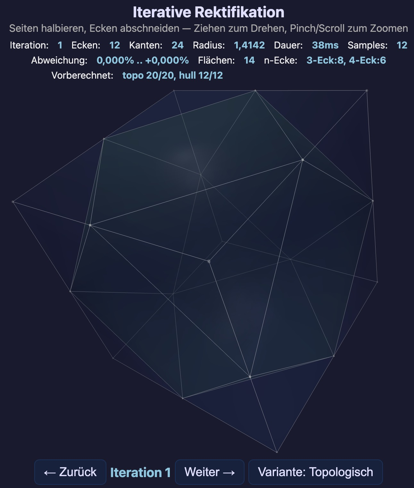

# Vom Würfel zur Kugel?

Interaktive 3D-Visualisierung: Einen Würfel iterativ rektifizieren und beobachten, wohin er konvergiert.

**[Live-Demo](https://crambambuli.github.io/cube-to-sphere/cube-rectification.html)**



## Das Problem

Gegeben ein Würfel. Man halbiert alle Kanten und schneidet an den Mittelpunkten die Ecken ab. Es entsteht ein neuer konvexer Körper mit mehr Flächen, Kanten und Ecken. Dieses Verfahren wiederholt man: wieder alle Kanten halbieren, wieder die Ecken abschneiden — und immer so weiter.

**Frage:** Welche Form entsteht, wenn man diesen Prozess unendlich oft wiederholt?

**Antwort:** Keine Kugel. Der Körper konvergiert gegen einen spezifischen O<sub>h</sub>-symmetrischen konvexen Körper mit ca. 14% Durchmesser-Variation — kugelähnlich, aber messbar nicht-sphärisch.

## Mathematischer Hintergrund

Die Operation heißt **Rektifikation** — man ersetzt jeden Vertex durch eine neue Fläche und jede Fläche durch eine kleinere Version ihrer selbst.

### Euler-Formel

Bei jeder Iteration gilt exakt (beweisbar über V - E + F = 2):

| Größe | Formel | Entwicklung |
|-------|--------|-------------|
| Ecken | V' = E | 8 → 12 → 24 → 48 → ... |
| Kanten | E' = 2E | 12 → 24 → 48 → 96 → ... |
| Flächen | F' = V + F | 6 → 14 → 26 → 50 → ... |

Die Kanten verdoppeln sich exakt bei jeder Iteration.

### Was erhalten bleibt

**O<sub>h</sub>-Symmetrie.** Der Würfel hat die Oktaedersymmetrie O<sub>h</sub> (48 Symmetrieoperationen). Die Bezeichnung stammt aus der Schoenflies-Notation: **O** steht für die Oktaeder-Drehgruppe (24 reine Drehungen), **h** für die Erweiterung um Spiegelungen. Dies ist gleichzeitig die Symmetriegruppe des Würfels und des Oktaeders, da beide duale Körper sind.

Jede Symmetrieoperation bildet Ecken auf Ecken, Kanten auf Kanten, Kantenmittelpunkte auf Kantenmittelpunkte ab. Die Menge der Mittelpunkte ist O<sub>h</sub>-invariant → die konvexe Hülle auch → jede Iteration erhält die O<sub>h</sub>-Symmetrie. ✓

### Warum der Grenzkörper keine Kugel ist

Die Vermutung liegt nahe, dass iterierte Rektifikation den Würfel zu einer Kugel glättet. Die numerische Simulation zeigt jedoch, dass die Abweichung von der Best-Fit-Kugel gegen einen **festen Wert konvergiert**, nicht gegen null:

```
Iter  Beule (außen)    Delle (innen)
─────────────────────────────────────────────────
  0   ▏                ▏                    0,000%
  1   ▏                ▏                    0,000%
  2   ▏                ▏                    0,000%
  3   ████▏            ████▏                2,548%
  4   ████████▏        ███████▏             4,884%
  5   ██████████▏      █████████▏           6,272%
  6   ████████████▏    ██████████▏          7,042%
  7   █████████████▏   ██████████▏          7,438%
  8   █████████████▏   ███████████▏         7,640%
  9   █████████████▏   ███████████▏         7,742%
 10   █████████████▏   ███████████▏         7,793%
 ...
 15   ██████████████▏  ███████████▏         7,843%
 20   ██████████████▏  ███████████▏         7,845%
         -7,845%          +6,604%
```

Iterationen 0–2 haben exakt 0% Abweichung, weil alle Vertices gleich weit vom Zentrum entfernt sind (Würfel, Kuboctaeder und dessen Rektifikation haben jeweils gleich lange Kanten und äquidistante Vertices).

| Iteration | Min (Beule) | Max (Delle) |
|-----------|-------------|-------------|
| 0 | 0,000% | +0,000% |
| 1 | 0,000% | +0,000% |
| 2 | 0,000% | +0,000% |
| 3 | -2,548% | +2,548% |
| 5 | -6,272% | +5,407% |
| 7 | -7,438% | +6,291% |
| 10 | -7,793% | +6,564% |
| 13 | -7,838% | +6,599% |
| 15 | -7,843% | +6,602% |
| 20 | -7,845% | +6,604% |

Die Abweichung stabilisiert sich bei **-7,845% / +6,604%** — der Körper konvergiert gegen einen nicht-sphärischen Grenzkörper. Bemerkenswert: die Beulen (an den Würfelecken) sind stärker ausgeprägt als die Dellen (an den Flächenzentren).

**Die Ursache: topologische Nicht-Uniformität.**

Ab Iteration 2 hat der Körper Vertices mit unterschiedlichem Grad (Anzahl angrenzender Kanten):
- Vertices an den 8 Würfelecken-Positionen: Grad 3 (Dreiecks-Vertex-Figur)
- Vertices an den 6 Flächenzentren: Grad 4 (Quadrat-Vertex-Figur)
- Weitere Vertex-Typen bei höheren Iterationen

Diese topologische Heterogenität bleibt bei jeder Iteration erhalten — sie wird nie homogen. Unterschiedliche Vertex-Grade erzeugen unterschiedliche lokale Geometrien, die durch Mittelwertbildung nicht ausgeglichen werden können.

Die Mittelwertbildung an einem Grad-3-Vertex mittelt über 3 Nachbarn, an einem Grad-4-Vertex über 4 Nachbarn. Diese strukturelle Asymmetrie erzeugt einen stationären Zustand, in dem die Beulen an den 8 Würfelecken-Positionen und die Dellen an den 6 Flächenzentren dauerhaft bestehen bleiben.

**Vergleich mit Subdivision Surfaces:** In der Computergrafik ist bekannt, dass "extraordinary vertices" (Vertices mit nicht-standardmäßiger Valenz) in Catmull-Clark- oder Loop-Subdivision die Grenzfläche lokal deformieren. Das gleiche Prinzip gilt hier — die 8 Würfelecken sind topologische Singularitäten, die den Grenzkörper dauerhaft von der Kugel unterscheiden.

### Der Grenzkörper

Der Grenzkörper ist ein wohldefinierter O<sub>h</sub>-symmetrischer konvexer Körper mit:
- 8 leichten Beulen an den Positionen der ursprünglichen Würfelecken
- 6 leichten Dellen an den Positionen der ursprünglichen Flächenzentren
- ca. 14% Unterschied zwischen größtem und kleinstem Durchmesser
- unendlich vielen Flächen (im Grenzwert glatt)

Er ist **kein** bekannter Standardkörper (weder Kugel noch ein reguläres Polyeder).

### Zwei Typen von Flächen

Bei jeder Rektifikation entstehen zwei Typen neuer Flächen:

- **Geschrumpfte Flächen** ("Quads"): Jede alte Fläche wird durch eine kleinere Fläche mit gleicher Kantenzahl ersetzt. Die Ecken der neuen Fläche sind die Mittelpunkte der alten Kanten. Ein Quadrat wird zu einem kleineren Quadrat, ein Dreieck zu einem kleineren Dreieck.

- **Vertex-Figuren**: Wenn man "die Ecken abschneidet", bleibt an jeder alten Ecke eine Schnittfläche. Ihre Kantenzahl entspricht dem Grad des alten Vertex (= Anzahl Kanten, die dort zusammenliefen). Beim Würfel hat jede Ecke 3 Kanten → Vertex-Figur ist ein Dreieck. Ab Iteration 1 haben alle Vertices Grad 4 → alle Vertex-Figuren sind Vierecke.

### Nur Dreiecke und Vierecke

Ab Iteration 1 gibt es ausschließlich **Dreiecke** und **Vierecke** — keine Fünf-, Sechsecke oder höher.

Der Grund: Jeder neue Vertex ist der Mittelpunkt einer alten Kante. Jede alte Kante grenzt an genau 2 Flächen und hat 2 Endpunkte (mit je einer Vertex-Figur). Also ist jeder neue Vertex von genau 4 Flächen umgeben → **alle Vertices haben Grad 4** → alle Vertex-Figuren sind Vierecke.

Konkret:
- **8 Dreiecke** — von den 8 Würfelecken. Bleiben als geschrumpfte Dreiecke über alle Iterationen erhalten. Sie sind die topologischen Singularitäten, die verhindern, dass der Körper zur Kugel konvergiert (sie sitzen an den 8 "Beulen").
- **Alle anderen Flächen: Vierecke** — geschrumpfte Quads + Vertex-Figuren (Grad 4).

### Sind die Flächen immer plan?

Geschrumpfte Flächen liegen immer exakt in einer Ebene (die Mittelpunkte der Kanten einer planaren Fläche sind koplanar). ✓

Vertex-Figuren (Vierecke) sind genau dann plan, wenn die 4 Nachbarn des alten Vertex koplanar sind. Das ist **nicht immer** der Fall:

- **Dreiecke** (die 8 von den Würfelecken): immer exakt plan — 3 Punkte definieren eine Ebene. ✓
- **Iter 1→2**: Der Kuboctaeder ist kantentransitiv (alle Kanten unter O<sub>h</sub> äquivalent). Die O<sub>h</sub>-Symmetrie erzwingt Koplanarität → alle Quads exakt plan. ✓
- **Iter 2→3**: Nicht mehr kantentransitiv. Quads an hochsymmetrischen Positionen (z.B. mit 4-facher Rotationsachse) sind noch exakt plan. Quads an weniger symmetrischen Positionen können leicht nicht-planar sein.
- **Ab Iter ~4-5**: Die meisten Quads sind fast plan (Abweichung schrumpft quadratisch mit der Kantenlänge), aber mathematisch nicht exakt — die lokale Symmetrie reicht nicht mehr aus.

**Konvexe-Hülle-Argument:** Betrachtet man die Rektifikation als konvexe Hülle aller Kantenmittelpunkte, sind alle Flächen per Definition plan. Allerdings kann die konvexe Hülle nicht-planare Vertex-Figuren in Dreiecke aufteilen — die resultierende Flächen-Topologie weicht dann von der kombinatorischen Rektifikation ab.

**Rendering nicht-planarer Quads:** Bei einem nicht-planaren Quad muss die 3D-Darstellung eine Entscheidung treffen, wie die Fläche approximiert wird. Es gibt mehrere Ansätze:

1. **Fan-Triangulierung (2 Dreiecke):** Quad wird entlang einer willkürlichen Diagonale in 2 Dreiecke geteilt. Einfach, aber erzeugt einen Knick an der Diagonale. Die andere Diagonale hätte einen anderen Knick erzeugt — die Wahl ist ein Implementierungsartefakt.
2. **Mittelpunkt-Triangulierung (4 Dreiecke):** ✅ Der Schwerpunkt der 4 Ecken wird als 5. Vertex eingefügt, das Quad in 4 Dreiecke geteilt. Kein willkürlicher Diagonalen-Knick, geometrisch fair — der Knick wird gleichmäßig auf alle 4 Seiten verteilt. **Diese Variante ist implementiert.**
3. **Kürzeste Diagonale:** Wie (1), aber die Diagonale mit dem kleineren Knickwinkel wählen. Visuell besser als willkürliche Wahl, aber immer noch ein asymmetrischer Knick.
4. **Bilineare Interpolation:** Das Quad als gewölbte Fläche (bilineares Patch) rendern, unterteilt in ein feines Gitter (z.B. 4×4 = 32 Dreiecke pro Quad). Kein Knick, dafür deutlich höhere GPU-Last. Bei der winzigen Nicht-Planarität (< 10⁻²) visuell nicht vom Mittelpunkt-Ansatz unterscheidbar.
5. **Catmull-Clark Subdivision:** Jedes Quad in 4 Sub-Quads mit geglätteten Positionen unterteilen. Erzeugt eine glatte Oberfläche, verändert aber die Geometrie (nicht mehr exakte Rektifikation).

Die Nicht-Planarität ist proportional zum Quadrat der Kantenlänge: bei Iter 3 in der Größenordnung 10⁻², bei Iter 10+ unter 10⁻⁸.

### Bemerkenswerte Zwischenkörper

- **Iteration 0:** Würfel (8 Ecken, 12 Kanten, 6 Flächen)
- **Iteration 1:** Kuboctaeder (12 Ecken, 24 Kanten, 14 Flächen) — ein archimedischer Körper
- **Iteration 2:** Rhombikuboctaeder-artig (24 Ecken, 48 Kanten, 26 Flächen)
- **Ab Iteration 5:** visuell kugelähnlich, aber messbar nicht-sphärisch

## Die Anwendung

### Darstellung

Die Anwendung zeigt den Körper in zwei Modi:

- **Iteration 0–12 (Polyeder-Modus):** Halbtransparente Flächen mit weißen Kanten und farbcodierten Vertex-Punkten. Die Flächen werden in zwei Passes gerendert (Rückseite, dann Vorderseite) für korrektes Alpha-Blending. Beim Iterationswechsel wird fließend zwischen altem und neuem Körper überblendet (1s Cross-Fade mit Ease-in-out).
- **Ab Iteration 13 (Kugel-Modus):** Eine halbtransparente Best-Fit-Kugel als Referenz. Der Körper schrumpft natürlich mit jeder Iteration (Kantenmittelpunkte liegen näher am Zentrum als die Endpunkte). Nur noch farbcodierte Vertex-Punkte sind sichtbar — die Flächen und Kanten würden bei >50.000 Vertices den Browser überlasten. Punkte werden mit `depthTest: false` gerendert, damit auch die innerhalb der Kugel liegenden (grünen) sichtbar bleiben.

### Farbcodierung der Punkte

Jeder Vertex-Punkt ist nach seiner Abweichung von der Best-Fit-Kugel eingefärbt:

- **Rot** — außerhalb der Kugel (Beule, an den Würfelecken-Positionen)
- **Grün** — innerhalb der Kugel (Delle, an den Flächenzentren)
- **Grau** — auf der Kugeloberfläche (Abweichung < 0,001%, z.B. bei Iter 0–2 wo alle Vertices exakt equidistant sind)

Die Farbintensität skaliert linear mit der Abweichung: je weiter vom Kugelradius, desto kräftiger die Farbe. Zusätzlich verblassen Punkte und Kanten mit zunehmender Entfernung zur Kamera (Live-Update bei Rotation, auch während der Animation): vordere Elemente sind kräftig, hintere blass.

### Sampling

Bei mehr als 50.000 Vertices (Desktop) bzw. 25.000 (Mobilgeräte) wird ein gleichmäßiges Zufalls-Sample angezeigt (Fisher-Yates Shuffle). Die Stats-Zeile zeigt die Anzahl der dargestellten Samples. Die Punktgröße nimmt mit jeder Iteration ab (0,014 bei Iter 0 → 0,003 ab Iter 13).

Bei Speicherfehlern (insbesondere auf Mobilgeräten) wird die Punktanzahl automatisch halbiert und das Rendering erneut versucht.

### Stats-Zeile

| Feld | Bedeutung |
|------|-----------|
| Iteration | Aktuelle Rektifikationsstufe (0 = Würfel) |
| Ecken | Anzahl Vertices (exakt aus Topologie, nicht Euler-Schätzung) |
| Kanten | Anzahl Kanten (verdoppelt sich pro Iteration: E' = 2E) |
| Radius | Durchschnittsabstand der Vertices vom Ursprung (schrumpft pro Iteration) |
| Dauer | Berechnungszeit der Iteration im Web Worker |
| Samples | Angezeigte Vertex-Punkte (= alle, oder Sample bei hohen Iterationen) |
| Abweichung | Min/Max-Abweichung von der Best-Fit-Kugel in Prozent |
| Vorberechnet | Anzahl bereits im Hintergrund berechneter Iterationen |

Werte zeigen "-" an, solange die Iteration noch berechnet wird.

### Vorberechnung

Iterationen werden im Hintergrund sequentiell vorberechnet (0 → 1 → 2 → ...). Der Web Worker berechnet jeweils die nächste Iteration, sobald die vorherige fertig ist. Beim Klick auf "Weiter" wird entweder das vorberechnete Ergebnis sofort angezeigt oder eine Sanduhr (⏳), bis die Berechnung abgeschlossen ist.

### Mobilgeräte

Auf Mobilgeräten (erkannt via User-Agent und Viewport-Breite < 768px) gelten reduzierte Limits:

| Parameter | Desktop | Mobil |
|-----------|---------|-------|
| Max. Iterationen | 20 | 18 |
| Max. Samples | 50.000 | 25.000 |

## Bedienung

| Aktion | Desktop | Mobil |
|--------|---------|-------|
| Nächste Iteration | Weiter-Button oder → oder Leertaste | Weiter-Button |
| Vorherige Iteration | Zurück-Button oder ← | Zurück-Button |
| Körper drehen | Maus ziehen | Finger ziehen |
| Zoomen | Scrollrad | Pinch-Geste |
| Rotation stoppen/starten | Doppelklick | Doppeltap |

Die Auto-Rotation pausiert 3 Sekunden nach manueller Interaktion und setzt dann wieder ein. Per Doppelklick/Doppeltap lässt sie sich dauerhaft stoppen bzw. wieder starten.

## Technische Umsetzung

### Architektur

```
  Main Thread                                            Web Worker
  (index.html)                                           (worker.js)

                          {iter}
  Three.js          ---------------------->              Topologische
  Rendering                                              Rektifikation
  UI/Events         <----------------------              Deviation-Berechnung
                     {coords, triIndices,                 Triangulierung
                      deviations, stats}
```

- **Main Thread** (`index.html`): Three.js-Szene, Kamera, Beleuchtung, Rendering, UI-Events. Keine geometrische Berechnung — nur Darstellung.
- **Web Worker** (`worker.js`): Topologische Rektifikation mit Polygon-Flächen. Pflegt eigenen Zustand (Vertices + Faces) über Iterationen. Gibt Koordinaten, triangulierte Indizes, Abweichungen und exakte Zählungen zurück.

### Topologische Rektifikation (worker.js)

Statt den Convex Hull zu berechnen und daraus Kanten zu extrahieren (ungenau bei fast-sphärischen Körpern), führt der Worker die **Flächen-Topologie** explizit mit:

1. **Kanten sammeln:** Aus den Polygon-Flächen werden alle Kanten und deren Mittelpunkte berechnet.
2. **Geschrumpfte Flächen:** Jede alte Fläche wird durch die Mittelpunkte ihrer Kanten ersetzt.
3. **Vertex-Figuren:** Für jeden alten Vertex werden die Mittelpunkte seiner Kanten in der richtigen zyklischen Reihenfolge (via Flächen-Adjazenz) zu einem neuen Polygon verbunden.
4. **Keine Normalisierung:** Der Körper behält seinen natürlichen Radius (schrumpft mit jeder Iteration).
5. **Deviations:** Abstand jedes Vertex von der Best-Fit-Kugel (Radius = Durchschnittsabstand).
6. **Triangulierung:** Fan-Triangulierung mit konsistenter Winding-Order (Normalen nach außen).
7. **Polygon-Kanten:** Kanten direkt aus den Polygon-Flächen (nicht aus der Triangulierung), um Diagonalen in Quads zu vermeiden.

### Rendering (index.html)

- **BufferGeometry** statt ConvexGeometry — der Worker liefert triangulierte Indizes, der Main Thread muss keinen Hull mehr berechnen.
- **Zwei-Pass-Blending** für transparente Flächen (erst Rückseiten mit `renderOrder=0`, dann Vorderseiten mit `renderOrder=1`).
- **Morph-Animation** (Iter 0–12): Cross-Fade zwischen altem und neuem Körper (1s, ease-in-out). Altes Mesh wird in separate Group verschoben und parallel ausgeblendet.
- **Farbcodierte Vertex-Punkte** über individuelle `MeshBasicMaterial`-Instanzen mit `depthTest: false` (immer sichtbar, auch hinter der Kugel).
- **Sphärische Kamerasteuerung** ohne OrbitControls (vermeidet Pointer-Capture-Konflikte).
- **Auto-Rotation** mit 3s Pause nach manueller Interaktion.

### Dateien

| Datei | Beschreibung |
|-------|-------------|
| `cube-rectification.html` | Standalone — eine einzige HTML-Datei mit inline Worker, funktioniert ohne Server |
| `index.html` | Main Thread: Three.js-Rendering, UI, Kamerasteuerung |
| `worker.js` | Web Worker: Topologische Rektifikation, Deviation-Berechnung, Triangulierung |
| `favicon.png` / `favicon-32.png` | Favicons (64×64 / 32×32, RGBA PNG mit transparentem Hintergrund) |
| `og-image.jpg` | Open-Graph-Vorschaubild für WhatsApp / Social Media |

### Lokal starten

```bash
# Standalone (Doppelklick oder):
open cube-rectification.html

# Oder mit Server (für index.html + worker.js):
python3 -m http.server 8766
# → http://localhost:8766
```

## Lizenz

MIT
